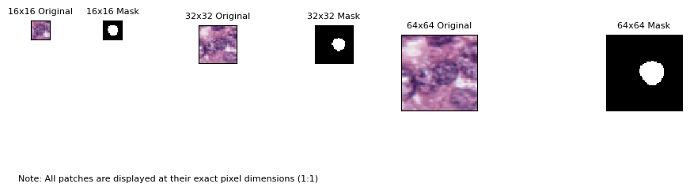
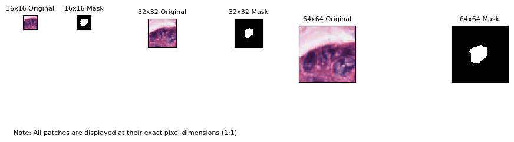

# PanNuke Dataset Processing

This repository contains scripts to process the PanNuke dataset, organize it into train and validation sets, and generate image patches for further analysis. The PanNuke dataset consists of 19 tissue types with 5 class types, and this repository focuses on processing `fold1` of the dataset.


## Overview

The PanNuke dataset is a large-scale dataset for nuclei instance segmentation and classification in histology images. It contains images and masks for 19 different tissue types, with 5 class types: `neoplastic`, `inflammatory`, `connective`, `dead`, and `epithelial`. This repository provides scripts to:

1. Organize the dataset into train and validation splits.
2. Extract specific cell types (e.g., neoplastic cells) and their corresponding masks.
3. Generate image patches at different resolutions (16x16, 32x32, 64x64) for training machine learning models.

## Repository Structure

```plaintext
PanNuke-Data-Processing/
├── README.md         # This file
├── organize_data.py  # Script to organize the dataset into train/val splits
├── celltypes.py      # Script to extract specific cell types (e.g., neoplastic)
├── patch.py          # Script to generate image patches
└── requirements.txt  # List of Python dependencies
```

## Dataset Preparation

The PanNuke dataset is organized into 3 folds (`fold1`, `fold2`, `fold3`). This repository processes `fold1`, which contains the following files:

*   `images.npy`: NumPy array of images.
*   `masks.npy`: NumPy array of masks.
*   `types.npy`: NumPy array of tissue types.

**Important:** You must download the PanNuke dataset `fold1` separately from the official source (https://warwick.ac.uk/fac/cross_fac/tissueimageanalytics/data/panuke/)  and place the `images.npy`, `masks.npy`, and `types.npy` files in a directory accessible to the scripts.

### Step 1: Organize the Dataset

The `organize_data.py` script organizes the dataset into train and validation splits. It removes images with no cells and saves the images and masks into a structured directory format.

#### Usage

1.  **Modify Paths:**  Edit the `image_path`, `mask_path`, and `types_path` variables in the `organize_data.py` script to point to the correct locations of your downloaded `.npy` files.
2.  **Run the script:**

    ```
    python organize_data.py
    ```

#### Output Directory Structure

After running the script, the dataset will be organized as follows:

```plaintext
/mnt/storage2/PanNuke/fold_01/
├── Adrenal_gland/
│   ├── train/
│   │   ├── images/         # Training images
│   │   └── masks/
│   │       ├── neoplastic/     # Neoplastic cell masks
│   │       ├── inflammatory/   # Inflammatory cell masks
│   │       └── ... (other cell types)
│   └── val/
│       ├── images/         # Validation images
│       └── masks/
│           ├── neoplastic/     # Neoplastic cell masks
│           ├── inflammatory/   # Inflammatory cell masks
│           └── ... (other cell types)
├── Bile-duct/
│   └── ... 
└── ... (other tissue types)
```

### Step 2: Extract Specific Cell Types

The `celltypes.py` script extracts specific cell types (e.g., neoplastic cells) and their corresponding masks. It copies the relevant images and masks into new directories.

#### Usage
 ```
python celltypes.py
 ```

#### Output Directory Structure

After running the script, the extracted data will be saved as follows:

```plaintext
/mnt/storage2/PanNuke/neoplastic/
├── neoplastic_images/ # Extracted neoplastic images
└── neoplastic_masks/ # Extracted neoplastic masks
```

### Step 3: Generate Image Patches

The `patch.py` script generates image patches at different resolutions (16x16, 32x32, 64x64) from the extracted images and masks.

#### Usage
 ```
python patch.py
 ```

#### Output Directory Structure

After running the script, the patches will be saved as follows:

```plaintext
/mnt/storage2/PanNuke/neoplastic/neoplastic_patch_dataset/
├── original/
│   ├── 16x16/                  # 16x16 image patches
│   ├── 32x32/                  # 32x32 image patches
│   └── 64x64/                  # 64x64 image patches
└── annotation/
    ├── 16x16/                  # 16x16 mask patches
    ├── 32x32/                  # 32x32 mask patches
    └── 64x64/                  # 64x64 mask patches
```




## Requirements

To run the scripts, you need the following Python packages:

*   numpy
*   opencv-python
*   scikit-image
*   Pillow (PIL)
*   tqdm

You can install the dependencies using:
 ```
pip install -r requirements.txt
 ```

## Usage Example

1.  Clone the repository:

    ```
    git clone https://github.com/your-username/PanNuke-Data-Processing.git
    cd PanNuke-Data-Processing
    ```

    **Note:** Replace `your-username` with your actual GitHub username.

2.  Install the dependencies:

    ```
    pip install -r requirements.txt
    ```

3.  Download the PanNuke dataset `fold1` and place the `.npy` files in a directory of your choice.

4.  Modify the file paths in `organize_data.py` to point to the correct locations of your downloaded `.npy` files.  The other scripts use hardcoded paths, so make sure your data matches those.

5.  Run the scripts in order:

    ```
    python organize_data.py
    python celltypes.py
    python patch.py
    ```

## Contributing

Contributions are welcome! If you find any issues or have suggestions for improvements, please open an issue or submit a pull request.


